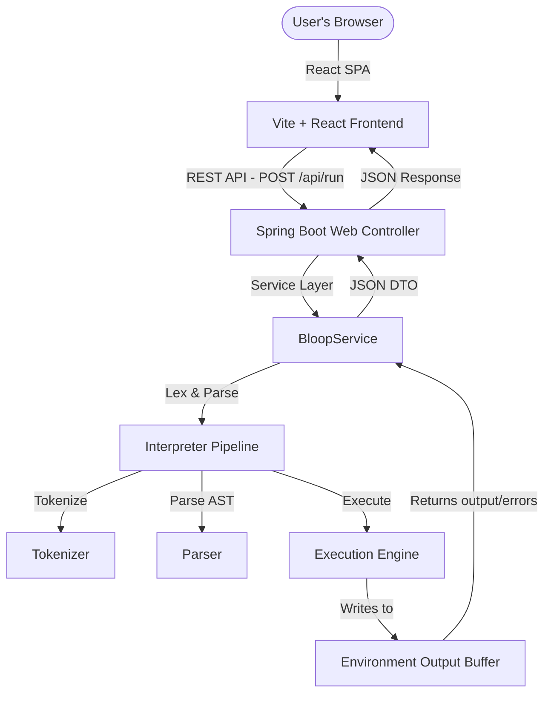

# 🚀 BLOOP Compiler & Playground

A production-grade, full-stack open-source programming language playground for **BLOOP**, a custom dynamically typed interpreted programming language. 

Features a rich interactive React web interface with a sandboxed Spring Boot execution server, integrated Monaco Code Editor (with custom BLOOP syntax highlighting), live example presets, compiler pipeline visualization, and comprehensive documentation.

---

## 🎨 Features

* **Interactive Playground**: Write BLOOP scripts with full syntax highlighting, error indicators, and live execution.
* **Presaved Examples**: Dropdown selection to load and run preset BLOOP programs instantly.
* **Decoupled Architecture**: Spring Boot REST backend executing code independently for concurrent client requests.
* **Pipeline Visualization**: Interactive tab outlining the Compilation Steps: *Source Code ➔ Tokenizer ➔ Parser ➔ AST ➔ Interpreter*.
* **Custom Syntax Styling**: Tailored Monarch tokens provider inside Monaco Editor matching the dark theme design system.
* **Production-Grade Infrastructure**: Dockerized setup supporting multi-stage builds and automated CI/CD builds.

---

## 👥 The Bloop Brigade (Team & Contributions)

* **Afzl Raza** — Tokenizer Module (Lexical Analysis & Token Mapping)
* **Rani Kumari** — Parser Module (Syntactical Grammar & AST Construction)
* **Gaurav Rathore** — Instruction & Expression Module (AST Nodes & execution context)

---

## 🏛️ Pipeline Architecture



Detailed documentation of each module can be found in the `/docs` folder:
* 🗺️ [Architecture Specification](docs/architecture.md)
* 🔤 [CFG EBNF Grammar](docs/grammar.md)
* 📖 [BLOOP Language Specification](docs/language-spec.md)

---

## 🚀 Running Locally

### 1. Prerequisites
* **Java 21 JDK** or newer
* **Node.js v18** or newer
* **Maven** (optional, wrapper/Docker handles packaging)

### 2. Launching the Spring Boot API
```bash
cd backend
mvn spring-boot:run
```
The REST API will be running on `http://localhost:8080`.

### 3. Launching the React SPA
```bash
cd frontend
npm install
npm run dev
```
Open `http://localhost:5173` in your browser.

---

## 🐳 Containerization (Docker)

To run the entire application as a single production-grade container:

### Build and Run with Docker Compose
```bash
docker-compose up --build
```
This builds the React app, copies the compiled static assets into Spring Boot's resource assets folder, builds the Spring Boot JAR, and exposes the unified container on port `8080` (accessible via `http://localhost:8080`).

---

## 🌐 Deployment

The entire BLOOP application is deployed as a **single Dockerized application** on Railway.

### Live Demo

🔗 https://bloop-programming-language-production.up.railway.app

### Deployment Architecture

```
User
   │
   ▼
Railway
   ├── React Frontend
   ├── Spring Boot REST API
   └── BLOOP Interpreter
```

The Docker image performs the following steps:

1. Builds the React frontend using Vite.
2. Copies the generated static assets into the Spring Boot application.
3. Packages the backend as an executable JAR.
4. Serves both the frontend and backend from a single Railway deployment.

To redeploy the application:

1. Push changes to the `main` branch.
2. Railway automatically detects the new commit.
3. A new Docker image is built and deployed.

## Some Screenshot of the interpreter


