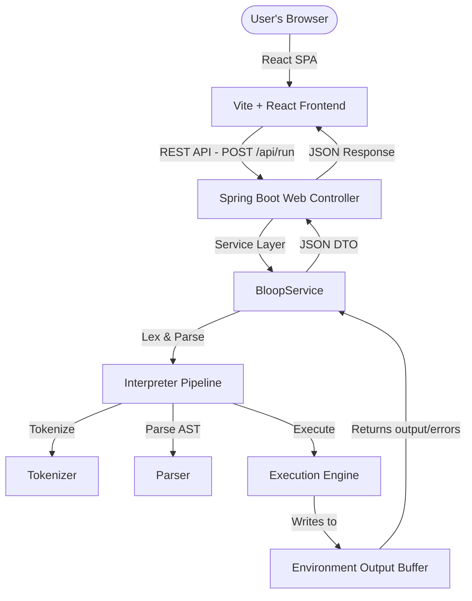

# BLOOP Playground: Architecture Specification

This document details the system design, execution pipeline, and components that power the BLOOP programming language compiler and playground.

---

## 🏛️ System Design

The application is structured as a decoupled full-stack architecture consisting of:
1. **React Frontend**: Single-page application providing a modern dashboard workspace (Monaco Editor, tab views, running terminal, pre-written examples).
2. **Spring Boot REST API**: Serves execution requests over HTTP POST (`/api/run`) and processes requests in an isolated environment container.
3. **BLOOP Interpreter Core**: The domain logic that parses and executes BLOOP code.

---

## 📂 Packages & Core Components

- **`com.bloop.tokenizer`**: Contains lexical analysis tools (`Tokenizer.java`, `Token.java`, `TokenType.java`).
- **`com.bloop.parser`**: Performs syntactical analysis (`Parser.java`) and maps token lists to AST nodes.
- **`com.bloop.interpreter`**: Implements tree nodes (`Expression.java`, `Instruction.java`), encapsulation factory (`ASTFactory.java`), memory scope (`Environment.java`), and execution coordinator (`Interpreter.java`).
- **`com.bloop.controller` & `com.bloop.service` & `com.bloop.dto`**: The Spring Boot web integration layers.

---

## 🔄 Execution Pipeline

### 1. Lexical Analysis (Tokenizer)
The source string is parsed character-by-character into token objects:
- Spacing and tabs are ignored (unless checking block indentations).
- String literals, digits, keywords (`put`, `into`, `print`), and operators are converted into `Token` data structures.

### 2. Syntactic Analysis (Parser)
The parser processes the token stream. It utilizes recursive descent parsing to group tokens into valid statements:
- Matches keywords like `put` or `print` to start parsing instructions.
- Re-groups expressions respecting order of operations (arithmetic brackets/multiplications before additions).

### 3. Execution (Interpreter)
Each statement node implements the `Instruction` interface. The interpreter creates an empty `Environment` variable store and loops over statement lists, invoking `execute(Environment)`.
- Standard output calls (from `PrintInstruction`) write to an internal buffer inside `Environment`.
- Variable lookups fetch values bound to names in the variable mapping.
